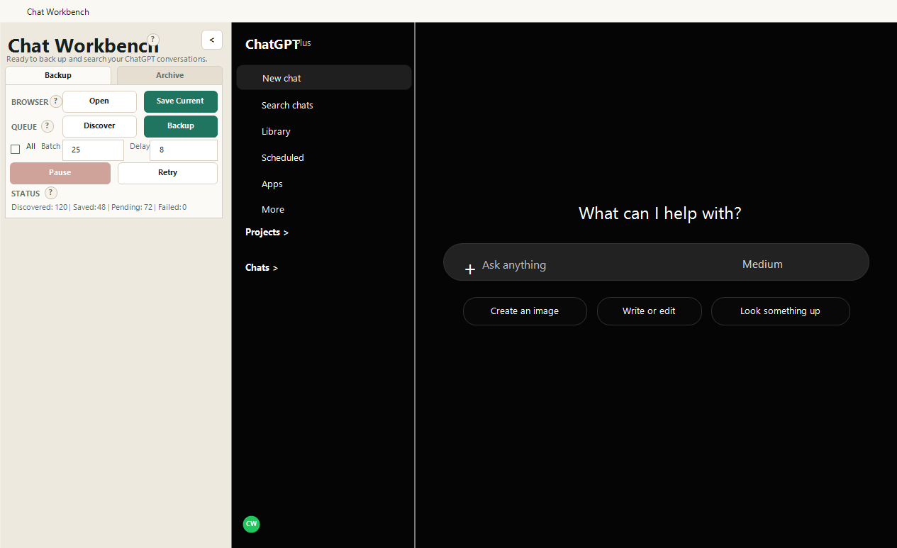
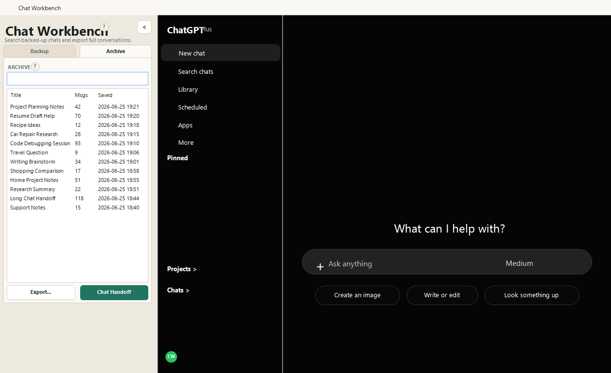

# Chat Workbench


Chat Workbench is a local Windows desktop app for backing up, searching, reopening, exporting, and handing off ChatGPT conversations.

It was built for the very specific pain of: "I know I talked about this somewhere, but the normal ChatGPT sidebar/search/export flow is not helping me find it."

## Features

- Opens ChatGPT inside a dedicated WebView2 browser window.
- Supports normal ChatGPT sign-in, including SSO and MFA.
- Discovers chats from the ChatGPT sidebar.
- Backs up pending chats in batches with a configurable delay.
- Pauses safely and detects ChatGPT temporary rate-limit dialogs.
- Stores backed-up chats locally in SQLite.
- Searches saved chat titles and message text quickly.
- Sorts archive results by title, message count, and saved date.
- Reopens a saved chat in ChatGPT by double-clicking an archive result.
- Exports full chat transcripts as Markdown.
- Creates Chat Handoff Markdown files for carrying a long conversation into a new chat.

## Screenshot





Avoid publishing screenshots that show private account names, project names, chat titles, or conversation content.

## How It Works

Chat Workbench uses your local logged-in ChatGPT browser session inside WebView2. You sign in once inside the app, then the app reuses that local WebView profile.

Backups are stored on your machine only. They are not uploaded by this app.

Current local storage paths:

```text
%LOCALAPPDATA%\GPTBackup\gpt-backup.sqlite
%LOCALAPPDATA%\GPTBackup\WebViewProfile
```

The storage folder still uses the original `GPTBackup` name for compatibility with earlier builds.

## Build

Requirements:

- Windows
- .NET 8 SDK
- Microsoft Edge WebView2 Runtime
- Inno Setup 6, only if building the installer

Restore and build:

```powershell
dotnet restore
dotnet build
```

Run from source:

```powershell
dotnet run
```

Publish a self-contained Windows build:

```powershell
dotnet publish -c Release -r win-x64 --self-contained true
```

Published executable:

```text
bin\Release\net8.0-windows\win-x64\publish\ChatWorkbench.exe
```

Build a Windows installer:

```powershell
.\installer\build-installer.ps1
```

If Inno Setup is not installed:

```powershell
winget install --id JRSoftware.InnoSetup
```

Installer output:

```text
artifacts\installer\ChatWorkbenchSetup.exe
```

The installer installs for the current Windows user and does not require admin rights.

## Basic Workflow

1. Open the app and sign in to ChatGPT if needed.
2. Click `Discover` to find chats from the sidebar.
3. Choose a batch size, or select `All`.
4. Set a delay between chats. Larger batches should use a larger delay.
5. Click `Backup`.
6. Use the `Archive` tab to search saved chats.
7. Export a transcript or create a `Chat Handoff` file when you want to continue a long conversation in a fresh chat.

## Privacy Notes

- Your ChatGPT session stays in your local WebView2 profile.
- Your backed-up chats are stored in a local SQLite database.
- Do not publish or share your local database, WebView profile, exported transcripts, or handoff files unless you have reviewed them.
- The source code does not include your ChatGPT login, cookies, database, or backup files.

## Limitations

- This app depends on the ChatGPT web experience and may need updates if ChatGPT changes its interface or internal endpoints.
- Backing up too quickly can trigger ChatGPT's temporary conversation rate limit. Use small batches and a delay.
- File/image attachment capture is not currently implemented.

## Support

Chat Workbench is free and open source. If it saves you time, donations are appreciated but never required.

## License

MIT
